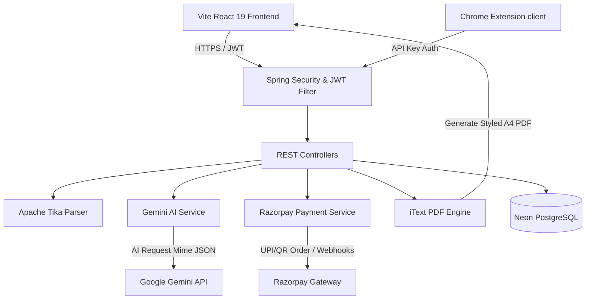

# 💎 ResuMatch AI — The Digital Career Curator

[](https://openjdk.org/)
[](https://spring.io/projects/spring-boot)
[](https://react.dev/)
[](https://tailwindcss.com/)
[](https://neon.tech/)
[](https://deepmind.google/technologies/gemini/)
[](https://razorpay.com/)

ResuMatch AI is a state-of-the-art, full-stack, AI-powered career optimization platform. Built with a robust **Spring Boot 3 (Java 21)** backend, a gorgeous, high-fidelity **React 19 (TypeScript & Vite)** frontend, and integrated with **Google Gemini 2.5 Flash**, it serves as an elite digital curator that transforms static resumes into high-impact, ATS-optimized narratives that win jobs.

---

## 🚀 Key Features

### 🛡️ Core Engine & Infrastructure
*   **Dual-Engine Parsing:** Utilizes **Apache Tika** for highly robust text extraction from PDF and DOCX files.
*   **Recruiter-Aligned ATS Auditing:** Seamless evaluation against custom industry standards and experience tiers (Entry, Mid, Senior, Lead).
*   **Google OAuth2 & JWT Security:** High-security auth flow leveraging Spring Security, JWT session handling, and CORS-enabled request filtering.
*   **Neon Serverless PostgreSQL:** Stably persists user data, resume states, subscription details, and usage metrics.

### 🧠 Gemini AI Powered Career Suites
*   **Job Tailor X-Ray Scan:** Upload your resume and a target Job Description. The system enforces **strict type validation** (ensuring only legitimate CVs and JDs are processed) and extracts missing/weak keywords, generates a custom ATS score, and suggests optimized STAR bullets.
*   **STAR Rewrite Engine:** Re-engineers resume achievements using the *Situation, Task, Action, Result* framework, matching specific target job description keywords.
*   **AI Cover Letter Generator:** Drafts highly contextualized cover letters. Features high-quality **iText-driven PDF generation** for immediate, styled A4 document downloads.
*   **Interactive Smart Flashcards:** Generates 5 high-impact, role-specific behavioral/technical interview prep questions, difficulty grading, and hiring manager context.
*   **Competitive Rank Predictor:** Simulates a virtual pool of 200 applicants to calculate the candidate's percentile rank, specific competitor advantages, and quick wins.

### 💳 Monetization & Extensions
*   **Tiered Monetization Architecture:** Subscriptions categorized into `FREE`, `STARTER`, `ACTIVE_HUNTER`, `PRO_ACHIEVER`, and `ELITE`.
*   **Razorpay Payment Gateway:** Direct checkout with automatic signature validation, secure payment verification, and asynchronous **webhooks** for instant account provisioning.
*   **Chrome Extension Support:** A lightweight, secure endpoint (`/api/v1/extension/quick-scan`) allowing Pro tier users to perform background matches directly from LinkedIn/Indeed.

---

## 📐 System Architecture

The following diagram illustrates how the frontend React app, backend Spring Boot engine, databases, and third-party APIs interact:



---

## 📂 Project Structure

```
ResuMatch AI/
├── backend/
│   ├── src/main/java/com/resumatch/
│   │   ├── config/             # Spring Security, CORS & Web Configuration
│   │   ├── controller/         # REST API Endpoints (Auth, Payments, AI, Resumes)
│   │   ├── exception/          # Custom exceptions (JWT, Auth, Gemini API)
│   │   ├── model/              # JPA Database Entities & Subscription Enums
│   │   ├── repository/         # Data Access Repositories (JPA / Hibernate)
│   │   └── service/            # Core Services (Gemini, iText PDF, Payments, Users)
│   ├── src/main/resources/
│   │   └── application.yml     # Application properties & ENV mappings
│   └── pom.xml                 # Maven dependencies (Java 21, Spring Boot 3.4.2)
│
├── frontend/
│   ├── src/
│   │   ├── components/         # Premium Reusable UI Elements (Modals, Upload Zones)
│   │   ├── context/            # React Contexts (Auth, Notifications)
│   │   ├── pages/              # Premium Screens (Dashboard, JobTailor, Pricing, Prep)
│   │   ├── App.tsx             # Route Configuration
│   │   └── index.css           # Custom styles with Tailwind CSS
│   ├── package.json            # React 19, Lucide Icons, Framer Motion, Recharts
│   └── vite.config.ts          # Vite bundling and Tailwind configuration
```

---

## 🛠️ Tech Stack & Integrations

| Layer | Technologies |
| :--- | :--- |
| **Frontend** | React 19, TypeScript, Vite, Tailwind CSS v4, Framer Motion, Recharts, Canvas-Confetti, Axios, Lucide Icons |
| **Backend** | Java 21, Spring Boot 3.4.2, Spring Security, JPA Hibernate, Apache Tika, iText PDF, Lombok, Maven |
| **Database** | PostgreSQL (Neon serverless cloud) / H2 in-memory |
| **API / Services** | Google Gemini API (model: `gemini-2.5-flash`), Razorpay Payment API & Webhooks, Google OAuth 2.0 |

---

## ⚙️ Setup & Local Installation

### Prerequisites
*   **Java Development Kit (JDK) 21** or higher.
*   **Node.js** (v18.0.0 or higher) and npm.
*   **PostgreSQL** instance (local or Neon.tech cloud).
*   **Google Gemini API Key** (obtainable via Google AI Studio).
*   **Razorpay Developer Credentials** (Key ID & Key Secret).
*   **Google Developer Console Credentials** (OAuth 2.0 Client ID & Client Secret).

---

### 🟢 1. Backend Configuration

Navigate to the `backend/` directory:

1.  **Configure Environment Variables:**
    Create a local configuration file or set the following system environment variables:

    ```bash
    export SPRING_DATASOURCE_URL=jdbc:postgresql://your-neon-database-url:5432/resumatch
    export SPRING_DATASOURCE_USERNAME=your_db_username
    export SPRING_DATASOURCE_PASSWORD=your_db_password
    export GOOGLE_CLIENT_ID=your_google_oauth_client_id
    export GOOGLE_CLIENT_SECRET=your_google_oauth_client_secret
    export JWT_SECRET=your_super_secure_jwt_signing_key_32_chars
    export RAZORPAY_KEY_ID=rzp_test_your_razorpay_key_id
    export RAZORPAY_KEY_SECRET=your_razorpay_key_secret
    export RAZORPAY_WEBHOOK_SECRET=your_razorpay_webhook_signing_secret
    export GEMINI_API_KEY=AIzaSy...your_gemini_api_key
    ```

2.  **Run with Maven:**
    ```bash
    ./mvnw spring-boot:run
    ```
    The backend server will spin up on `http://localhost:8080` (or your configured port).

---

### 🔵 2. Frontend Configuration

Navigate to the `frontend/` directory:

1.  **Install dependencies:**
    ```bash
    npm install
    ```

2.  **Configure API Proxy:**
    The React application is configured to proxy `/api/v1` calls to the Spring Boot backend server. Ensure `vite.config.ts` matches your backend setup:
    ```typescript
    server: {
      proxy: {
        '/api': {
          target: 'http://localhost:8080',
          changeOrigin: true,
        }
      }
    }
    ```

3.  **Start development server:**
    ```bash
    npm run dev
    ```
    Open your browser and visit `http://localhost:5173`.

---

## 🔌 API Endpoints Summary

### 🔑 Authentication
*   `POST /api/v1/auth/register` — Standard email registration.
*   `POST /api/v1/auth/login` — Standard login returning JWT.
*   `GET /api/v1/auth/me` — Fetches current user profile.
*   `POST /api/v1/auth/google` — Verifies Google OAuth token.

### 📄 Resume Management & Analysis
*   `POST /api/v1/resume/upload` — Multipart file upload (PDF/DOCX) processed via Apache Tika.
*   `GET /api/v1/resume/history` — Lists past audits and analyses for the user.
*   `POST /api/v1/resume/analyze` — Evaluates parsed text against target industry & experience.

### 🧠 Premium Features (Requires Active Hunter / Pro Achiever)
*   `POST /api/v1/premium/star` — Generate STAR-compliant optimized resume bullet points.
*   `POST /api/v1/premium/flashcards` — Role-specific behavioral prep interview flashcards.
*   `POST /api/v1/premium/cover-letter` — Creates dynamic customized cover letter parts.
*   `POST /api/v1/premium/competitive-rank` — Runs mock applicant pool simulation percentile rankings.
*   `POST /api/v1/premium/generate-pdf` — Converts cover letter JSON into a styled downloadable A4 PDF.

### 💳 Payments & Subscription
*   `POST /api/v1/payments/create-order` — Initiates Razorpay Order.
*   `POST /api/v1/payments/verify` — Validates signature and upgrades subscription tier.
*   `POST /api/v1/payments/webhook` — Listens to Razorpay payment events asynchronously.

### 🔌 Browser Extension
*   `POST /api/v1/extension/quick-scan` — API Key validated matching service for extension quick-audits.

---

## 🎨 UI & Premium Aesthetic Guidelines

ResuMatch AI leverages custom glassmorphic styling, high-contrast dark visual structures, and beautiful micro-animations:
*   **Color Palette:** Premium dark background (`#030712`), vivid royal indigo primaries (`#4F46E5`), and glowing cyan/purple gradients.
*   **Typography:** Elegant Google Fonts integration (e.g., *Inter*, *Outfit*, or *Roboto*).
*   **Micro-interactions:** Interactive hover states, sleek loader indicators, and celebratory bursts (via `canvas-confetti`) when payments verify or resume audits finish.
*   **Responsive Layout:** Fully responsive dashboard widgets, pricing matrices, and analysis scorecards built using Tailwind CSS grid layouts.

---

## 📄 License & Contributions

Contributions are welcome! Please fork the repository, open a feature branch, and submit a pull request. 

This project is licensed under the [MIT License](LICENSE). 

*Created and maintained with ❤️ by Abhirup Bhowmick.*
